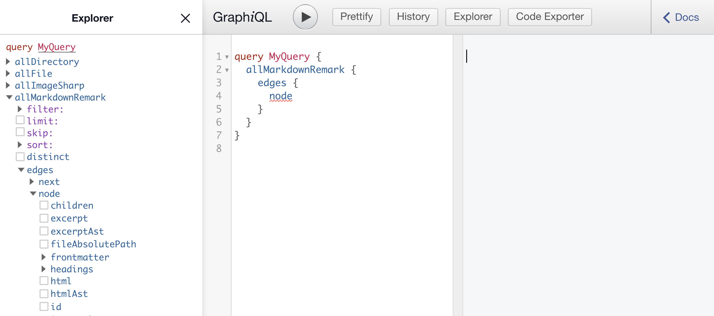
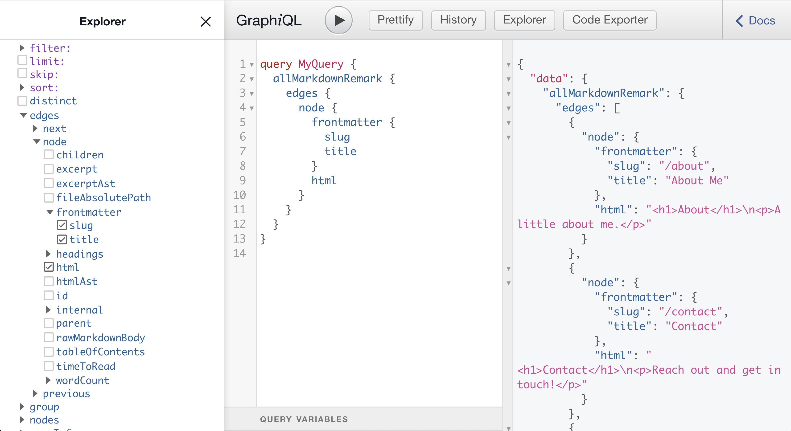
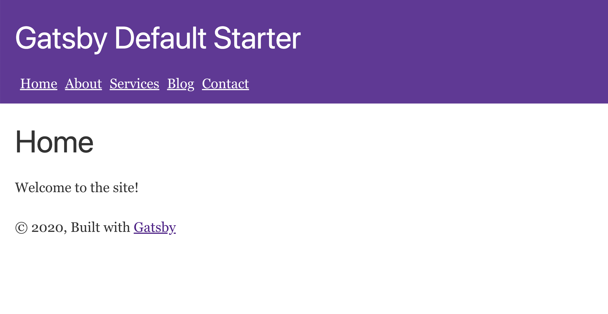

# Creating Pages in Gatsby

We saw in the last chapter that if we create a React component in the `/src/pages/` directory, Gatsby will automatically create a page for it.

There are many times however when you do not want to code your pages with React.  This can make it especially hard for less technical content creators and editors.

In this chapter we are going to learn how we can write our page content in Markdown (and MDX), a simple markup language.

We will then import it into Gatsby and then programmatically create pages from our Markdown files.

This is similar to the process of creating and managing your content in a Content Management System (CMS) and programmatically creating pages from the CMS.

##  A Brief Introduction to Markdown

Markdown is a markup language, similar to HTML, but much much simpler.

Markdown is often used with a tool or library that converts the markdown into HTML to be used on a page.

If you have not used markdown before, here is an example of a few of the things you can do.

```
# An h1 Header

## An h2 Header

A basic paragraph

Some rich text formatting: _italics_ and **bold**

Here is an unordered list:

- Item 1
- Item 2
- Item 3

Here is an ordered list:

1. Item 1
2. Item 2
3. Item 3

This would be a [link to a site](https://gatsbyexplained.com)

And this below would show an image:


There is more you can do to!

```

If you are new to markdown, you might want to do a quick search for a Markdown Cheatsheet to get an idea of everything you can do.

We will be using markdown to create our page content for two reasons:

1. It is much simpler than hard coding JSX in React templates in the `/src/pages/` folder.
2. It will demonstrate our ability to import data *outside* of the `/src` folder into Gatsby.

Now let's go ahead and setup a new Gatsby project so we can begin adding markdown pages.

## Start a New Project

To start off, create a new Gatsby project called `chapter-03` in the same folder you started the last project from.

You can use the following command:

```
gatsby new chapter-03 
```

Once this project is created, navigate into the folder.  This is where we will work for this chapter.

## Create Some Markdown Pages

Create a new `/content/` directory in the root of the `chapter-03` project.

Then create a folder in that called `pages`.  Finally add in a number of markdown files like this:

```
\content
	\pages
		home.md
		about.md
		services.md
		blog.md
		contact.md
\src
// Other Gatsby files...
```

To start off, just add some dummy content like this into each of the markdown files.

```
# Page Title

Some basic content.
```

If you are new to markdown you can play around with it in these pages a bit. We will come back later to make the pages look how we want for the final site.

## Frontmatter in Markdown Files

Gatsby allows us to store metadata in our markdown files that can be quite helpful for things like the page title, the page slug or a link to a featured image.

Here is an example of the frontmatter we are going add to our `home.md` file.  

```
---
slug: ""
title: "Homepage"
---

# Home

Welcome to my site!
```

We can see that the frontmatter is saved at the top of the markdown file inside of a set of three hyphens `---`.  We can add any frontmatter fields we want, and these will later be accessible in Gatsby along with the content in the page, which will be converted to HTML.

Notice that the slug is empty for this specific page because it is the homepage.

Go ahead and add a `slug` and `title` frontmatter fields to each of our markdown pages.

For example, here is what the `about.md` file should look like:

```
---
slug: "about"
title: "About Me"
---

# About

Learn a little about me.
```

Now that we have our markdown pages setup we have to tell Gatsby where to find these files.

## Reading From Local Files

Gatsby has a plugin called `gatsby-source-filesystem` that lets you find and read local files.

This plugin is actually already installed with our Gatsby project when we run `gatsby new` so we do not have to install the plugin.  But we do have to configure it.

Open up your `gatsby-config.js` file and find the section where `gatsby-source-filesystem` is setup to find local images:

```
    {
      resolve: `gatsby-source-filesystem`,
      options: {
        name: `images`,
        path: `${__dirname}/src/images`,
      },
    },
```

We are actually going to duplicate this line and customize it to find our markdown pages.

Update that section of the configuration file to look like this:

```
    {
      resolve: `gatsby-source-filesystem`,
      options: {
        name: `pages`,
        path: `${__dirname}/content/pages`,
      },
    },
    {
      resolve: `gatsby-source-filesystem`,
      options: {
        name: `images`,
        path: `${__dirname}/src/images`,
      },
    },
```

Now that Gatsby can find our markdown files, we have to add another plugin for it to be able to read the Markdown files and work with them.

Run the following command in your project folder:

```
npm install --save gatsby-transformer-remark
```

Then open your `gatsby-config` file again and add `gatsby-transformer-remark` to the list of plugins.  

This plugin will not have options like `gatsby-source-filesystem`.

```
  plugins: [
    `gatsby-plugin-react-helmet`,
    `gatsby-transformer-remark`,
    {
      resolve: `gatsby-source-filesystem`,
      options: {
        name: `images`,
        path: `${__dirname}/src/images`,
      },
    },
    // Rest is the same...
```

Now, when we next run `gatsby develop` Gatsby will find all our markdown pages and make their contents available to us.

## Querying Gatsby Data with Graph*i*QL

Graph*i*QL is a tool for easily testing GraphQL queries in a visual environment.

Gatsby has Graph*i*QL built in to the development server.  So when you run `gatsby develop` you can visit the following URL to access Graph*i*QL with all of your Gatsby data.

```
http://localhost:8000/___graphql
```

Go ahead and start up the development server and visit that URL.

Use the Explorer to open "allMarkdownRemark," then "edges" and finally "node".



Before we go further let's pause to explain a few terms:

1. `allMarkdownRemark` - This is where Gatsby stores any markdown files found inside of the directories we told `gatsby-source-filesystem` to look for `images` and `pages` in the `gatsby-config.js` file.
2. `edges` - This is a GraphQL term that refers to a collection of items.
3. `node` - This is another GraphQL term that refers to a single item.

When you query collections of items in GraphQL, you will often query the edges then node.

Inside of the Explore, go further into "node" and open the "frontmatter."  You can see here the options we set for frontmatter in our pages: `slug` and `title`.

Go ahead and check both of these boxes.

Then look below `frontmatter` and select `html` too.  This will give you the markdown from each file converted into HTML, which is what we will add to our Gatsby pages.

It is the `gatsby-transformer-remark` plugin that does this conversion of the Markdown to HTML for us.

This is what your final query in Graph*i*QL should look like when you press the play/run button:



This query below is very similar to the one we will eventually drop into our Gatsby code to query our markdown pages and programmatically create pages from them.

```
query MyQuery {
  allMarkdownRemark {
    edges {
      node {
        frontmatter {
          slug
          title
        }
        html
      }
    }
  }
}
```

So, now that we have an idea of what GraphQL looks like and how it works, let's look at how to create a template to control how our markdown pages will eventually display on our site.

## Creating a Page Template

Go ahead and create a new directory in the `src` folder called `templates`.  

Then create a new file in that directory called `page.js`.  This will serve as our page template.

You can copy over and modify the contents of `/src/pages/index.js` file to start with or just type out the template as you see below:

```
import React from "react"
import { graphql } from "gatsby"

import Layout from "../components/layout"
import SEO from "../components/seo"

const PageTemplate = ({ data }) => {
  const { frontmatter, html } = data.markdownRemark
  return (
    <Layout>
      <SEO title={frontmatter.title} />
      <div dangerouslySetInnerHTML={{ __html: html }} />
    </Layout>
  )
}

export default PageTemplate

export const pageQuery = graphql`
  query($slug: String!) {
    markdownRemark(frontmatter: { slug: { eq: $slug } }) {
      html
      frontmatter {
        title
      }
    }
  }
`
```

A few important things are going on here:

1. We are importing `graphql` so we can make a GraphQL query in this component
2. Our main `PageTemplate` component is receiving a value in props called `data`.  This data will come from the GraphQL query at the bottom of the file.
3. We are destructuring `frontmatter` and `html` from the `markdownRemark`.
4. We are passing the `frontmatter.title` to our SEO component to be displayed in the page `<title>` tag.
5. In order to display the HTML, we have to use React's `dangerouslySetInnerHTML`, which is the way to add HTML into a React element.
6. Finally, at the bottom of the page we have a custom GraphQL query that gets the page `title` and `html` based on a slug.

Let's unpack a few of these things further.

The overall structure of a Gatsby template involves a component that receives a `data` property on props. This data contains the results of the GraphQL query that is exported at the bottom of the page.

In our next step we will see how a template knows what slug to look for, but for now we can say that a slug will be passed to the template.  Then in the template we use that slug to query for the rest of the page data.  Finally we use that data how we want in the main template component.

Another important thing to note is that we are querying `markdownRemark`, not `allMarkdownRemark` like we did in the previous section when we queried all of our markdown pages.

If we want to search for a single markdown page we use `markdownRemark` and if we want to query multiple pages we use `allMarkdownRemark`.  Gatsby has similar conventions for things like `file` and `allFile` or `imageSharp` and `allImageSharp`.

Let's look at this query we are using in a bit more depth as well:

```
export const pageQuery = graphql`
  query($slug: String!) {
    markdownRemark(frontmatter: { slug: { eq: $slug } }) {
      html
      frontmatter {
        title
      }
    }
  }
`
```

First, `query($slug: String!)` is telling us that we are going to receive a variable of `slug`.  We will pass this slug in to the template in our next step.

Then, this bit of code below says to get the page where the frontmatter slug is equal to the slug we receive as a variable.

```
markdownRemark(frontmatter: { slug: { eq: $slug } })
```

This is referred to as a filter in GraphQL and you will commonly see them in Gatsby template files when you have to query for a specific page or post based on the value of a certain field, like the slug or ID.

As a final note, notice that we are also wrapping our page in the main `<Layout />` component.  Some sites may require multiple layout components, if for instance you wanted a sidebar on some pages.

With our template ready, we can now go through and programmatically create all of our pages and assign them to the template we just created.


## Creating Pages Programmatically

When we create a page programmatically, the process takes place during the Gatsby build process.

For that reason, each time we run `gatsby develop` or `gatsby build` it will run our queries and create our dynamic pages.  For this reason, we want to shut down our development server before beginning.

Go ahead and open the `gatsby-node.js` file.  This file is used for code accessing the Gatsby Node API, which includes the `createPages` function.

You can delete any comments in the file and add the following:

```
exports.createPages = async ({ actions, graphql, reporter }) => {
	const { createPage } = actions
}
```

What this tells Gatsby, is when it comes time to create pages, execute the following code.

Then inside of this we are getting a function called `createPage` that is passed in as part of the props.  This basic structure is what you will need for programmatically creating pages in Gatsby.

Next we want to get the page template we just created.

```
exports.createPages = async ({ actions, graphql, reporter }) => {
	const { createPage } = actions
	const pageTemplate = require.resolve(`./src/templates/page.js`)
}
```

After that we have to make a query to get the slugs for all of the markdown pages we have created.

```
exports.createPages = async ({ actions, graphql, reporter }) => {
	const { createPage } = actions
	const pageTemplate = require.resolve(`./src/templates/page.js`)
  const result = await graphql(`
    {
      allMarkdownRemark {
        edges {
          node {
            frontmatter {
              slug
            }
          }
        }
      }
    }
  `)
}
```

This is how we will get all of our page slugs, which we will later pass in to our `pageTemplate`.

After the `result` query is setup, add the following lines of code to display an error if something goes wrong during this process:

```
  // Handle errors
  if (result.errors) {
    reporter.panicOnBuild(`Error while running GraphQL pages query.`)
    return
  }
```

Finally, we will create a page for each slug we queried.

```
  result.data.allMarkdownRemark.edges.forEach(({ node }) => {
    createPage({
      path: `/${node.frontmatter.slug}`,
      component: pageTemplate,
      context: {
        // additional data can be passed via context
        slug: node.frontmatter.slug,
      },
    })
  })
```

Here we can see that `createPage` accepts an object as a parameter with the following properties:

- path: This will determine the URL for the page created
- component: This is the template for the page
- context: This is where we pass in the slug variable to the GraphQL query at the bottom of our page template.

Now, when Gatsby starts building its static pages during the build process it will also execute this custom and create static pages for each of our markdown pages and render them using the PageTemplate we created.

Here is what the final code will look like:

```
exports.createPages = async ({ actions, graphql, reporter }) => {
  const { createPage } = actions
  const pageTemplate = require.resolve(`./src/templates/page.js`)
  const result = await graphql(`
    {
      allMarkdownRemark {
        edges {
          node {
            frontmatter {
              slug
            }
          }
        }
      }
    }
  `)
  // Handle errors
  if (result.errors) {
    reporter.panicOnBuild(`Error while running GraphQL query.`)
    return
  }
  result.data.allMarkdownRemark.edges.forEach(({ node }) => {
    createPage({
      path: `/${node.frontmatter.slug}`,
      component: pageTemplate,
      context: {
        // additional data can be passed via context
        slug: node.frontmatter.slug,
      },
    })
  })
}
```

This structure for creating custom pages is very common in Gatsby.  We will write similar code when we create posts for our site as well in the next chapter.  We would also put similar code if we were creating static pages from a CMS.

## Removing Our Pages from the `/src` Directory

In our markdown file for `home.md` we set the slug equal to `/`.  This will create a conflict in Gatsby because there is an `index.js` file in the `/src/pages/` folder.

To prevent duplication issues between the static React template pages and our markdown pages go ahead and delete all of the pages in the `/src/pages` directory *except for the 404.js*.

## Testing to See if the Pages Are Created

To test what we have done go ahead and run `gatsby develop`.  You should see the server successfully start.
\
When you visit the homepage you should see the content from the `home.md` file.  Likewise you should be able to navigate to `http://localhost:8000/about` as well as the other pages you setup.

We have now completed the process for creating pages in Gatsby programmatically from an outside data source, in this case Markdown.

## Adding a Menu to the Site

To close out this chapter we are going to build a menu that will  link to the different pages.
\
This is actually a pretty simple process.

Open up the `/components/header.js` file and come down to the closing `</div>` tag before the closing `</header>` tag.

Add the following set of links before the closing of the `</div>` tag.  

	```
			<ul className="menu">
			  <li>
			    <Link to="/">Home</Link>
			  </li>
			  <li>
			    <Link to="/about">About</Link>
			  </li>
			  <li>
			    <Link to="/services">Services</Link>
			  </li>
			  <li>
			    <Link to="/blog">Blog</Link>
			  </li>
			  <li>
			    <Link to="/contact">Contact</Link>
			  </li>
			</ul>
		</div>
	</header>
	```

Notice that we are also adding a class of menu for easy styling.

Now create a `header.css` file in the `components` folder and add the following:

```
.menu {
  display: flex;
  list-style-type: none;
  margin: 1rem 0 0;
}
.menu li {
  padding-right: 10px;
}
.menu li a {
  color: white;
}
```

Finally, import the `header.css` file at the top of the `header.js` file.

```
import { Link } from "gatsby"
import PropTypes from "prop-types"
import React from "react"

import "./header.css"
```

This will make sure that our styles apply.

Here is a screenshot of the final version of what we have built in this chapter:



## Review and Next Steps

In this chapter we learned that you can use external content sources, such as markdown.  In the next chapter we will create a different type of data, blog posts, using markdown as well.
\
This will show us how to query two different types of data as well as give us an opportunity to work on features like listing pages and pagination.

For this process we will copy over what we created in this chapter into the next chapter project so we can keep building on what we have.