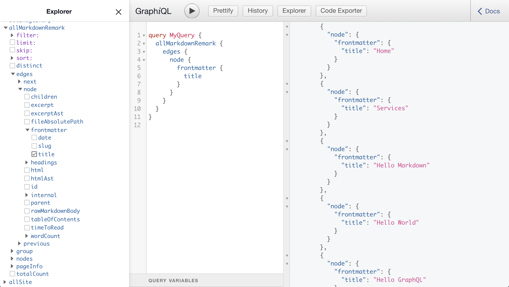
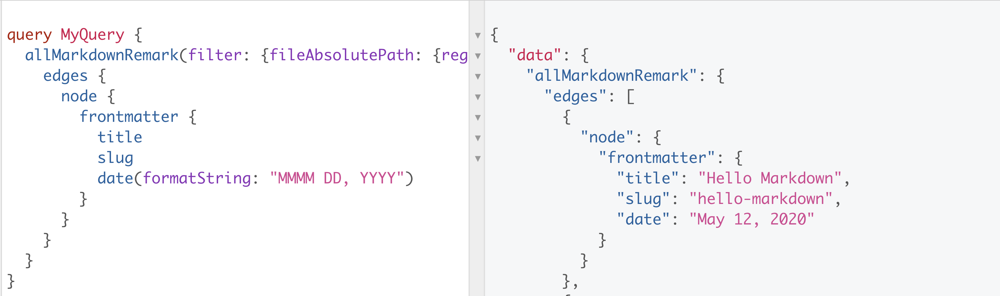
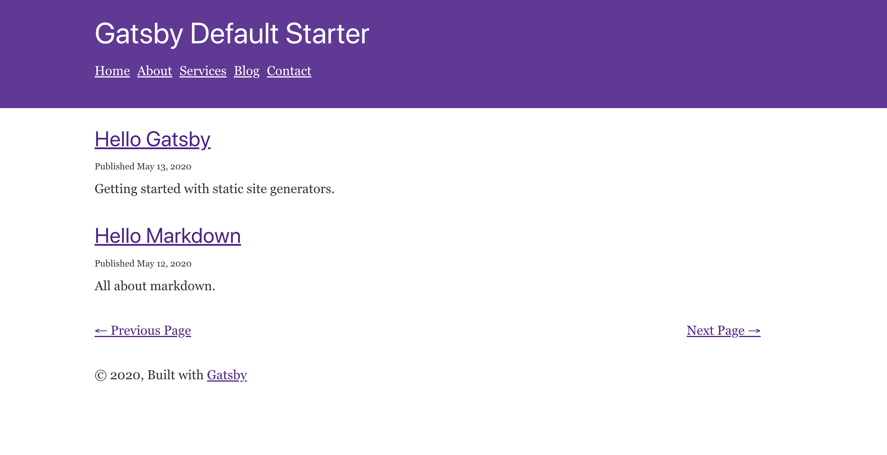

# Creating Posts in Gatsby

In this chapter we will look at how to add blog posts to the project we built in the last chapter with pages.

We will use Markdown files again for this so some of the setup process will be very similar.

However, we will have to setup a listing page for our blog posts in addition to the single blog post page.  This will also give us an opportunity to look at one way for creating pagination with static Gatsby sites.

## Getting Setup

Let's start off with copying over the code from the last chapter into this code for this chapter. That way we can build on what we already created.

Create a duplicate of the `chapter-03` directory and rename it to `chapter-04`.

Now you should have an already working Gatsby site with Markdown pages.

## Adding Markdown Posts

Go ahead and create a new folder in the `content` directory called `posts`.

There are a few different ways you can name and organize your markdown posts.  

Some people use a shortened version of the title for the file name.  Others like to use the publish date.

You can also do a combination of a date or timestamp and an excerpt of the title of the post.

There is another option to create a directory based on date and name the file based on the title.

Here are examples of each of these naming and organizing structure.

```
/content
	/posts
		hello-world.md          // Using title
		2020-05-11.md           // Using date
		20200511-hello-world    // Using date and title
		/2020-05-11
			hello-world.md        // Date directory
			second-post-today.md  // with title filename
```

For the purposes of this book, we will choose the option that includes the data and the title.  

This lets our blog posts naturally display in order of date in our folder, which can make posts easier to go back and find later.  We also include the title so we can tell what a post was about at a quick glance.

Go ahead and create a five markdown blog posts.

```
/content
	/posts
		20200511-hello-world.md
		20200512-hello-markdown.md
		20200513-hello-gatsby.md
		20200514-hello-graphql.md
		20200515-hello-new-site.md
```

Inside of each post add some frontmatter for the `date`, `excerpt`, `slug`, and `title`.  Then add in some placeholder content for each post.

Here is an example of `20200511-hello-world.md`:

```
---
slug: "hello-world"
date: "2020-05-11"
title: "Hello World"
excerpt: "A hello world post."
---

# Hello World!

This is my first blog post.
```

Once you have each of these created we can move on to adding our `posts` directory to our `gatsby-config.js`.

*NOTE* With our pages we included a `/` in the slug to designate it as a root level page.  With our blog posts we are leaving out the `/` because our eventual URL will look like `/blog/slug` and we will create that structure in our `gatsby-node.js` file later.

## Telling Gatsby Where to Find Our Posts

Now we have to creating a setting for the `gatsby-source-filesystem` plugin to find our posts.

We are going to duplicate what we did for our pages here and make a few changes.

Open your `gatsby-config.js` file and add the following configuration for `posts` underneath `pages`.

```
    {
      resolve: `gatsby-source-filesystem`,
      options: {
        name: `pages`,
        path: `${__dirname}/content/pages`,
      },
    },
    {
      resolve: `gatsby-source-filesystem`,
      options: {
        name: `posts`,
        path: `${__dirname}/content/posts`,
	  },
```

Now we will be able to query for markdown files inside of the `pages` directory or inside the `posts` directory.

## Querying Markdown Files Based on Location

If we run `gatsby develop` and open Graph*i*QL we will see both pages and posts listed when we query `allMarkdownRemark`.



This is going to cause some issues in our `gatsby-nod.js` where we created pages by querying all content from `allMarkdownRemark`.

What we need to do is add in a filter so we can distinguish between pages and posts.  There are several ways we can do this, but the approach we are going to take is by telling GraphQL to only search in the `pages` folder for pages and `posts` folder for posts.

Here is what our query will look like for posts:

```
query MyQuery {
  allMarkdownRemark(
	  filter: {
		  fileAbsolutePath: {
			  regex: "/(posts)/"
		  }
	  }) {
    edges {
      node {
        frontmatter {
          date
	        slug
          title
        }
        html
      }
    }
  }
}
```

We have not seen filters yet in GraphQL.  What we have done with  this filter is tell GraphQL to look at the path of each markdown file and see if it contains `/posts/`.

Since a path for a post will look something like the path below then it will contain show up in this query.

```
.../chapter-04/content/posts/hello-world.md
```

On the other hand pages will look like something below and will not show up in our posts query.  We will modify the original query we wrote for our later.

```
.../chapter-04/content/pages/home.md
```

Before we can go back to our `gatsby-node.js` and add in our new queries, we have to build a template to display our posts.

## Creating a Posts Template

Our posts template will look very similar to our page template.  So, to start let's copy over the content from `src/templates/page.js` to a new file `src/templates/page.js`.

The first change we will need to make is that we want to query the date in the frontmatter.  GraphQL offers us a nice and easy way to format the date at the same time we query it.



This formatting is done using specifications from "MomentJS" a JavaScript library for working with dates.

You can find more details on the different date formats here on the MomentJS website here: https://momentjs.com/docs/#/displaying/format/.

So the first change to our template we will make is to our query at the bottom, modify it to the following:

```
export const pageQuery = graphql`
  query($slug: String!) {
    markdownRemark(frontmatter: { slug: { eq: $slug } }) {
      html
      frontmatter {
        date(formatString: "MMMM DD, YYYY")
        title
      }
    }
  }
`
```

Then we will add in the date above the content area in the main component.  

```
const PostTemplate = ({ data }) => {
  const { frontmatter, html } = data.markdownRemark
  return (
    <Layout>
      <SEO title={frontmatter.title} />
      <p style={{ fontSize: `70%` }}>
	      Published {frontmatter.date}
		  </p>
      <div dangerouslySetInnerHTML={{ __html: html }} />
    </Layout>
  )
}

export default PostTemplate
```

We have also added some styles to the date font size to make it 70% the size of other text.  You could also add a class and style that way if you like.

Notice that we rename the component to `PostTemplate` as well.  Make sure to change the name where the component is defined and where it is exported.

We should now have our post template properly setup and we can move on to creating our posts in the `gatsby-node.js` file.

## Creating Posts Dynamically with `createPage`

Before we create our posts, let's go back to our page query in `gatsby-node.js` and update it to only include markdown files in the `pages` directory.

Find the following line of code:

```
  const result = await graphql(`
    {
      allMarkdownRemark {
        edges {
          node {
            frontmatter {
              slug
            }
          }
        }
      }
    }
  `)
```

And make the following updates:

```
  const pages = await graphql(`
    {
      allMarkdownRemark(filter: { 
	      fileAbsolutePath: { 
		      regex: "/(pages)/" 
			  } 
		  }) {
        edges {
          node {
            frontmatter {
              slug
            }
          }
        }
      }
    }
  `)
```

We are also changes the variable name `results` to `pages`.  You will also have to update the following lines of code to refer to the name `pages` as well:

```
if (results.errors) {
```

```
results.data.allMarkdownRemark.edges.forEach(({ node }) => {
```

These should now read like this:

```
if (pages.errors) {
```

```
pages.data.allMarkdownRemark.edges.forEach(({ node }) => {
```

Now, below all of our pages code, but still inside of the overall `exports.createPages` call, lets setup a variable for our posts template.

```
const postTemplate = require.resolve(`./src/templates/post.js`)
```

We then want to setup our query for all of our posts.  We are going to add something new here as well.  We are going to tell GraphQL to order the posts in descending order by the date in the frontmatter.  This will have newer posts appear first.

```
const posts = await graphql(`
  {
    allMarkdownRemark(
      filter: { fileAbsolutePath: { regex: "/(posts)/" } }
      sort: { order: DESC, fields: frontmatter___date }
    ) {
      edges {
        node {
          frontmatter {
            slug
          }
        }
      }
    }
  }
`)
```

Next up throw in some simple code to throw any errors if something goes wrong:

```
// Handle errors
if (posts.errors) {
	reporter.panicOnBuild(`Error while running GraphQL posts query.`)
	return
}
```

Now that we have our query setup we can move on to the actual post creation process.

This will look very similar to the page creation process except we are going to modify the path so that it will include `/blog/` before the slug we assigned in the posts frontmatter.

```
posts.data.allMarkdownRemark.edges.forEach(({ node }) => {
  createPage({
    path: `/blog/${node.frontmatter.slug}`,
    component: postTemplate,
    context: {
      slug: node.frontmatter.slug,
    },
	})
})
```

When we run `gatsby develop` now we should be able to visit the url `http://localhost:8000/blog/hello-world/` and see our "Hello World" blog post.


Although it seems like we are done here, we still have one problem.  

If we visit our Blog page we see the content from our `blog.md` markdown file, but we don't see our posts listed.  So, in our next step we will look at how we can create post listing pages, including adding pagination.

## How to Create Listing Pages on a Gatsby Site

With a non-static website we can create one blog listing page template and it will dynamically display different information based on the URL.

With a static site we create a static listing page with the specific blog posts listed on that page.  If our site has pagination then we need to create a static page for each of the listing pages.
\
We will take the approach of setting up a listing page with pagination.

This will require the following steps:

1. Create a blog listing page template.
2. Have this template accept what page it is in the pagination order from context and query the relevant posts for that listing page.
3. Define the number of posts we want listed per page in our `gatsby-config.js` file
4. Create a new static page for each X number of posts.  Pass in the pagination page number to the list page template.
5. Create a pagination component to display in the blog list page template.

If these steps seem a little confusing, don't worry!  We will move through it all step by step and then you will be able to use this for future projects that require pagination.

## Creating Blog Listing Pages Programmatically

We are going to build this part of the site in reverse order of how we normally approach it.

Before we start we need to go in a remove the `content/pages/blog.md` file since we will now create the blog listing pages via a React template rather than a markdown file.

Once that is done, we can write the code in our `gatsby-node.js` that will create our blog post listing pages.  Then we will create our template.

We are doing this because we are going to pass in some custom values to our pageContext that we have not seen before.  If we do this first, the queries our blog listing template will make much more sense.

So, let's start off in the `gatsby-node.js` file before where we put the code for creating blog posts.

Then add in the following lines of code:

```
  const postsTemplate = require.resolve(`./src/templates/posts.js`)
  const postsPerPage = 2
  const numPages = Math.ceil(
    posts.data.allMarkdownRemark.edges.length / postsPerPage
  )
```

Most of this code should make sense:

- First we give the location of where our posts template will soon be located.
- We then set the total number of posts you want on each page.  Later you may which to change this to a higher number, but for testing purposes just two posts per page will be helpful.
- Finally we have to figure out the total number of pages by rounding up from the total number of posts divided by the number of posts per page.

Next we're going to add the following segment of code:

```
  Array.from({ length: numPages }).forEach((_, i) => {
    createPage({
      path: i === 0 ? `/blog` : `/blog/${i}`,
      component: postsTemplate,
      context: {
        limit: postsPerPage,
        skip: i * postsPerPage,
        numPages,
        currentPage: i + 1,
      },
    })
  })
```

This code may not make as much sense at first pass, so let's dig in a bit to what is happening here.

First we are creating an array with a length set to the total number of pages we should have.  Then we loop over each of those pages.

Then we call `createPages` with the following configurations:

- `path` - We set this to `/blog` if it is the first page and `/blog/1` for second page, `/blog/2` for third page, etc.
- `component` - This we have seen before.  It simply takes the component we want to use as the template for this page.  We will create that in the next section.
- `context` - Here we are passing in a number of values we will need in our templates\

Within `context` we also have a few other values:

- `limit` - This tells us how many posts to query on each posts template.
- `skip` - This is based on how many list pages we have created.  It will let us skip the posts from previous pages.
- `numPages` - Simply the total number of listing pages.  This is helpful for our pagination.
- `currentPage` - This will be helpful for us to know exactly which of the blog listing pages is currently being viewed.

These values, especially in `context` are extremely important and likely values you will use in future projects requiring pagination as well.

We now have everything setup in our `gatsby-node.js`.  Now we can turn our attention to creating the posts template.

## Creating a Blog Listing Page Template

Although it will not look exactly the same, we are going to copy the contents from the `src/templates/post.js` template and copy it in to a new file `src/templates/posts.js`.

Then remove most of the code so you have the following starting point:

```
import React from "react"
import { graphql, Link } from "gatsby"

import Layout from "../components/layout"
import SEO from "../components/seo"

const PostsTemplate = ({ data }) => {
  return (
    <Layout>
      <SEO title="Blog Post Archive" />
    </Layout>
  )
}

export default PostsTemplate

export const postsQuery = graphql``
```

Notice that we have also made a few small changes:

- Imported `Link` from `gatsby`
- Changed the name of the component to `PostsTemplate`
- Put in a temporary title for the `<SEO />` component
- Renamed and removed our GraphQL query

Now we can go about adding in the proper code we need.

First lets setup the query that will pull in our posts:

```
export const postsQuery = graphql`
  query($skip: Int!, $limit: Int!) {
    allMarkdownRemark(
      filter: { fileAbsolutePath: { regex: "/(posts)/" } }
      sort: { fields: [frontmatter___date], order: DESC }
      limit: $limit
      skip: $skip
    ) {
      edges {
        node {
          frontmatter {
            date(formatString: "MMMM DD, YYYY")
            excerpt
            slug
            title
          }
        }
      }
    }
  }
`
```

Here we can see that we are receiving the `skip` and `limit` variables that we passed in via context in the previous step.

We can also see that we are filtering our posts and ordering them by most recent date.

Then we get our collection of posts and the `date`, `excerpt`, `slug`, and `title` for each post.

Now we can turn our attention to the `PostsTemplate` component.  For now, add the following:

```
const PostsTemplate = ({ data, classes, pageContext }) => {
  const posts = data.allMarkdownRemark.edges
  return (
    <Layout>
      <SEO title={`
	      Blog Post Archive - 
	      Page ${pageContext.currentPage}
      `} />
      {posts.map(({ node }) => (
        <article key={node.frontmatter.slug}>
          <h2>
            <Link to={`/blog/${node.frontmatter.slug}`}>
              {node.frontmatter.title}
            </Link>
          </h2>
          <p style={{ fontSize: `70%` }}>
	          Published {node.frontmatter.date}
		      </p>
          <p>{node.frontmatter.excerpt}</p>
        </article>
      ))}
    </Layout>
  )
}
```

Let's break this down a bit.  We are seeing that we have received `data`, `classes` and `pageContext` via props.  We won't use `classes` but we need to specify it in order to get to the third parameter, `pageContext`.
\
Then we simplify the way we can refer to our `posts`.

Inside of the `<SEO />` component we are listing the blog listing page number in the title.

Then we map over all of our posts and setup an `<article>` tag for each one.  Inside of that we have the following:

- A title with a link to the post
- The date published (styled a little smaller)
- The excerpt for the post

This completes the basic build process.

You can now run `gatsby develop` and navigate to the following URLS to see posts listed:

```
http://localhost:8000/blog
http://localhost:8000/blog/1
http://localhost:8000/blog/2
```

One thing you will notice is that the font spacing does not flow very well.

Create a `src/templates/posts.css` file with the following CSS:

```
article {
  margin-bottom: 2rem;
}

h2,
p {
  margin-bottom: 10px;
}

h2 + p {
  margin-bottom: 5px;
}
```

Then make sure that you import the CSS at the top of the template like this:

```
import "./posts.css"
```

Although these pages now look and work as expected, we need to add some pagination navigation so a user can navigate from the main blog pages to the other pages.

## Creating a Pagination Component

For now we will create a simple pagination that includes a link to older posts and newer posts.  Later we will go back and create a more traditional looking pagination navigation.

Create a new component at `src/components/navigation.js`.

Add the following as a starting point.

```
import React from "react"
import { Link } from "gatsby"

const Pagination = ({ 
		pageContext: { currentPage, numPages } 
	}) => {

  return (
    <nav
      style={{
        display: `flex`,
        justifyContent: `space-between`,
        margin: `2rem 0`,
      }}
    >
      <Link to={} rel="prev">
        ← Previous Page
      </Link>
      <Link to={} rel="next">
        Next Page →
      </Link>
    </nav>
  )
}

export default Pagination

```

We can see here that we are going to accept in `pageContext` from props and we are destructuring `currentPage` and `numPags` from that.

You also have links that will eventually go to previous and next pages.  We will also wrap each of these in its conditional statement so they will only show up when appropriate.

Next we will need to setup four variables:

- `isFirst` - Determines if we are currently on the first page and only a "Next Page" link should show.
- `isLast` - Determines if we are on the last page and only a "Previous Page" link should show.
- `prevPage` - The URL we will add to the `<Link />` for the "Previous Page."
- `nextPage` - The URL we will add to the `<Link />` for the "Next Page."

With these variables we will be able to create our conditionals and complete our link `to` properties.

Here is the logic for how we will determine `isFirst` and `isLast`.  Add these as variables before the `return` statement.

```
const isFirst = currentPage === 1
const isLast = currentPage === numPages
``` 

When we are on the first of our blog list pages, the value of `currentPage` is set to `1`.  We can verify that by looking at the `createPage()` function for our blog listing pages found in the `gatsby-config.js` file.

```
Array.from({ length: numPages }).forEach((_, i) => {
const path = i === 0 ? `/blog` : `/blog/${i}`
createPage({
  path,
  component: postsTemplate,
  context: {
    limit: postsPerPage,
    skip: i * postsPerPage,
    numPages,
    currentPage: i + 1,
  },
})
})
```

Since the value of `i` is `0` the first time through our `forEach` then `i + 1` is going to equal `1` the first time through.

For `isLast` we are seeing if `currentPage` is equal to `numPages`.  This will be true when the `currentPage` is the last page.

Next we want to figure out the URL for the previous and next links.

```
const prevPage = currentPage - 1 === 1 ? "/blog" : 
	`/blog/${currentPage - 2}`
const nextPage = `/blog/${currentPage}`
```

First, let's look at what the value of `currentPage` will be for each of our blog listing pages.

```
/blog/         currentPage = 1
/blog/1/       currentPage = 2
/blog/2/       currentPage = 3
```

Notice that currentPage is always one more than the link in the URL.  And on the first page we only have `/blog/`, not `/blog/0/`.

So, to determine `prevPage` we first check to see if `currentPage - 1 === 1`.  This will be true if we are on the second page.  In this case, the previous link will go to `/blog/`.

However, if we are on the third page (or higher), the URL for the previous page should be equal to `currentPage - 2`.  

For example on `/blog/2`, the the `currentPage` is `3` and previous URL should be `/blog/1`.

This may seem a little confusing because the currentPage value is different from the page number in the URL.

To calculate the `nextPage` we simply pass in the `currentPage` to the URL.  

So on the `/blog/` page, the the `currentPage` is `1` and next URL should be `/blog/1`.  Again we have to calculate for the page number URL being one less than the value of `currentPage`.

Now that we have all of these values calculated we can add in some conditional wrappers for our links and populate the `to` prop on the link components.

Here is what our final `Pagination` component will look like.

```
import React from "react"
import { Link } from "gatsby"

const Pagination = ({
  pageContext,
  pageContext: { currentPage, numPages },
}) => {
  const isFirst = currentPage === 1
  const isLast = currentPage === numPages
  const prevPage = currentPage - 1 === 1 ? "/blog" : `/blog/${currentPage - 2}`
  const nextPage = `/blog/${currentPage}`

  console.log(pageContext, isFirst, isLast, prevPage, nextPage)
  return (
    <nav
      style={{
        display: `flex`,
        justifyContent: `space-between`,
        margin: `2rem 0`,
      }}
    >
      {!isFirst && (
        <Link to={prevPage} rel="prev">
          ← Previous Page
        </Link>
      )}
      {!isLast && (
        <Link to={nextPage} rel="next">
          Next Page →
        </Link>
      )}
    </nav>
  )
}

export default Pagination
```

The last thing we have to do is import our `Pagination` component into our `posts.js` template with the following line at the top of the file:

```
import Layout from "../components/layout"
import SEO from "../components/seo"
import Pagination from "../components/pagination"
```

Then we can add our `Pagination` component before our closing `<Layout />` tag and pass in `pageContent` as props.

```
const PostsTemplate = ({ data, classes, pageContext }) => {
  const posts = data.allMarkdownRemark.edges
  return (
    <Layout>
      <SEO title={`Blog Post Archive - Page ${pageContext.currentPage}`} />
      {posts.map(({ node }) => (
        <article key={node.frontmatter.slug}>
          <h2>
            <Link to={`/blog/${node.frontmatter.slug}`}>
              {node.frontmatter.title}
            </Link>
          </h2>
          <p style={{ fontSize: `70%` }}>Published {node.frontmatter.date}</p>
          <p>{node.frontmatter.excerpt}</p>
        </article>
      ))}
      <Pagination pageContext={pageContext} />
    </Layout>
  )
}
```

Now, when you visit your site you should see pagination like this on the blog listing pages:



## Next Steps

There is more we could add to our posts: comments, categories, custom layouts, fancier pagination, authors, etc.  We will revisit some of this in future chapters, but for now we should have what we need.

In this chapter we learned an important lesson: how to create listing pages with pagination and single page views.  No doubt you will need to do this for not just posts but possibly lots of other types of dynamic content on our sites.

When you do have to do this in the future, you can always come back to the example code from this chapter as a starting point.

Now we are going to turn our attention to working with images in Gatsby, which is a very interesting topic because of the optimization and extra stuff that Gatsby can do with images.