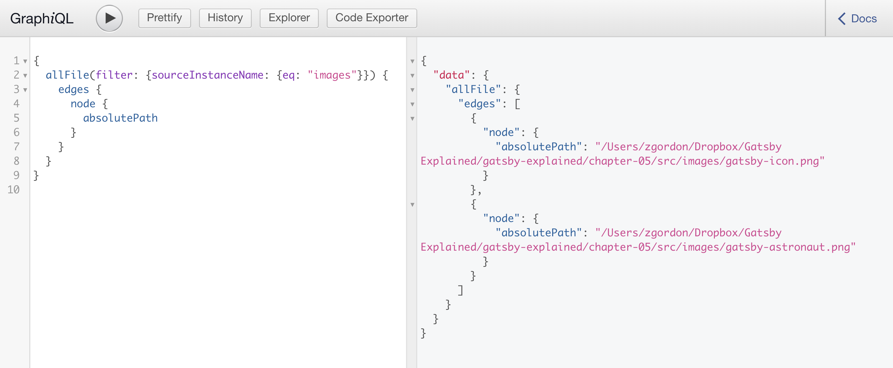
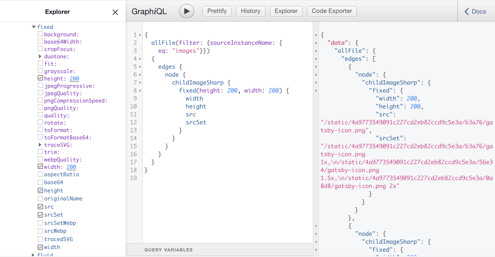
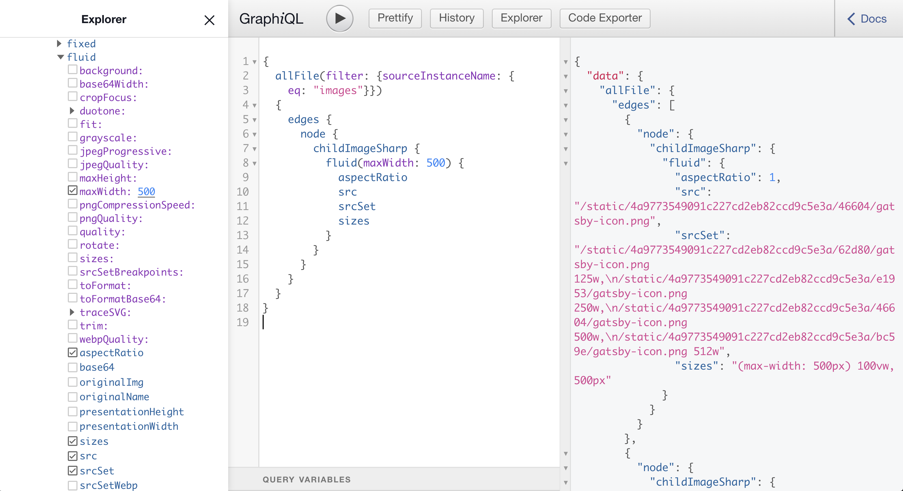
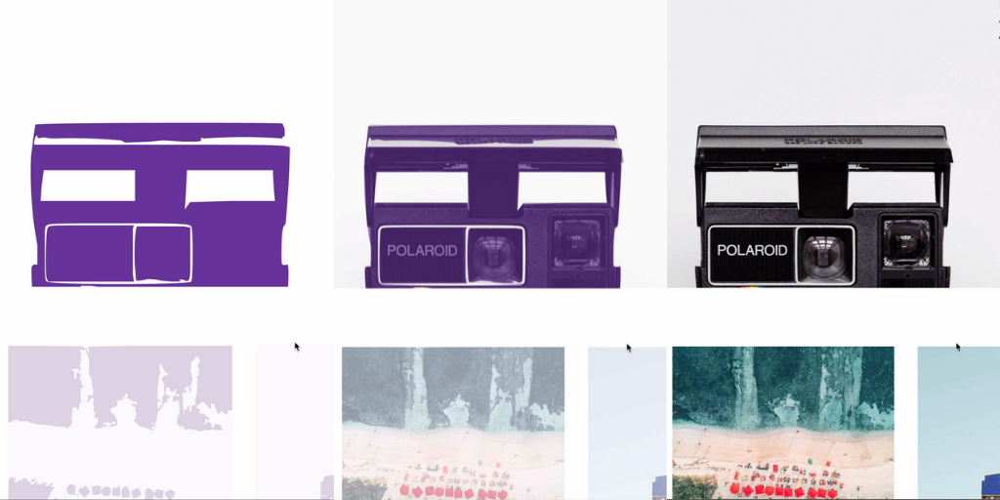

# Images in Gatsby

There are several ways you can work with images in Gatsby.  At times you may have images hardcoded into your React components or CSS.  Using images in this way works the same way it would in any React app.

Other times your images will be embedded in your markdown files or come into Gatsby via a CMS like WordPress.  This process is slightly different.

Gatsby projects also commonly integrate with a Node image optimization library called Sharp.  The Sharp library, along with a few related plugins will speed up image load times dramatically as well as provide a custom React components for loading images.

## Including Images in React Templates or Styles

The most basic way to include an image is to import the file into your React template or link to it from a CSS file.

Let's imagine for example that we had the following file structure (this is just an example and not included in our chapter code).

```
/src
	/components
	/images
		test-image.png
		background-image.png
	/pages
		404.js
		index.css
		index.js
```

Notice that we have an `images` directory with two images in it.  

If we open up the `/pages/index.js` file we can see how we can import this image and add it to our component:

```
import React from "react"

import testImage from "../images/test-image.png"

const IndexPage = () => (
  <Layout>
    <SEO title="Test" />
    <h1>Test</h1>
    
  </Layout>
)

export default IndexPage

```

Notice that when we import an image into our React file we will get a path to the image that we can pass into an `` tag.

If we open up the `index.css` we can see how to include one of these images in our CSS.

```
body {
  background: url(../images/gatsby-icon.png);
}
```

Here we do not have to import the file, we simply link to it using a relative path, just as we would in a normal CSS file.

While these methods work they miss out on many of some of the additional features and optimizations that are usually implemented in Gatsby projects.

This approach also links directly to the image files.  In Gatsby it is recommended to pull images in via GraphQL queries.  Eventually these queries will let us request specific image sizes and resolutions.

## Querying Images with GraphQL

If we launch our Gatsby project with `gatsby-develop`  and visit the Graph*i*QL interface we can make a query to `allFile` in order to find our images.



Here is the query again:

```
{
  allFile(filter: {sourceInstanceName: {eq: "images"}}) {
    edges {
      node {
        absolutePath
      }
    }
  }
}
```

Notice that we set a filter for `sourceInstanceName` equal to `images`.  This maps to the `name` option when configuring `gatsby-source-filesystem` in our `gatsby-config.js` file.

```
{
  resolve: `gatsby-source-filesystem`,
  options: {
    name: `images`,
    path: `${__dirname}/src/images`,
  },
},
```

This means that our GraphQP query will get above will get us all of our images in the `/src/images/` folder.

Once we setup the Gatsby Image component we will be able to query more information than the absolute path.  However, querying images with GraphQL in general will be something you do commonly in Gatsby projects.

Now let's take a look at the Gatsby Image component.

## The Gatsby Image Component

The Gatsby Image component is a special React component that provides some amazing features out of the box.

Here is the list of features from the documentation:

- Loads the optimal size of image for each device size and screen resolution
- Holds the image position while loading so your page doesn’t jump around as images load
- Uses the “blur-up” effect i.e. it loads a tiny version of the image to show while the full image is loading
- Alternatively provides a “traced placeholder” SVG of the image
- Lazy loads images, which reduces bandwidth and speeds the initial load time
- Uses WebP images, if browser supports the format
- Provides GraphQL fragments for faster queries

Gatsby Image does not come by default as part of Gatsby.  It relies on the Sharp image processing library and must be installed with a few plugins:

- `gatsby-image` - Includes actual React component
- `gatsby-plugin-sharp` - Provides image processing features from Sharp
- `gatsby-transformer-sharp` - Provides options for creating different sizes and resolutions of images

The default Gatsby starter that we get with `gatsby new project-name` already includes everything we need to use Gatsby Image.

However, if you were starting without it, you would run the following command:

```
npm install gatsby-transformer-sharp gatsby-plugin-sharp gatsby-image
```

This will install the necessary packages.  Then update the `gatsby-config.js` with the following addition to the plugins array:

```
  plugins: [
    `gatsby-transformer-sharp`,
    `gatsby-plugin-sharp`,
    {
      resolve: `gatsby-source-filesystem`,
      options: {
        name: `images`,
        path: `${__dirname}/src/images`,
      },
    },    
```

Again, we already have this setup with our default Gatsby started, but it is helpful to check to see if a Gatsby project has these configurations setup before attempting to use Gatsby Image.

## Querying Images for Use with Gatsby Image

Gatsby Image supports a two types of images:

1. Fixed width and height images
2. Fluid images that stretch to fill their container

It is important to know what type of image you want in your page so that you can make the appropriate query.

In order to test our queries, open up Grap*i*QL and query `allFile` again as we did earlier.


Notice now that we have an we have an option for `childImageSharp` option.

Within that we have two important fields: `fluid` and `fixed`. When we query an image for Gatsby Image we will get our images from within one of these.

### Fixed Height Queries

Let's start with looking at fixed width image queries first.  Here is a common query:



Here we get tell the query we want a `200px` square image size.  Then we get the `width`, `height`, `src`, and `srcSet`.  

Receiving `srcSet` is nice because it lets the browser load the best sized image based on the device.

Some other common fields you can get are `base64` and `tracedSVG`, which allow for image fade in effects we will discuss below.  You may also see `srcWebp` and `srcSetWebp` for getting WebP images that are highly optimized.

```
{
  allFile(filter: {sourceInstanceName: {eq: "images"}}) {
    edges {
      node {
        childImageSharp {
          fixed(height: 200, width: 200) {
            width
            height
            src
            srcSet
            base64
            tracedSVG
            srcSetWebp
            srcWebp
          }
        }
      }
    }
  }
}
```

When you know that you want a fixed image this is the type of query you will write.

### Fluid Image Queries

When you have an image that will stretch to fill its contain you want to use a `fluid` query.



Here we see the use of setting a max width, which is optional, but often a good idea.

Then we have similar fields requested, along with the `aspectRatio`, which will let the Image Component know how to stretch the image.

You can also get fields like `base64`, `tracedSVG`, `srcWebp` and `srcSetWebp` for fluid images.

### Image Query Fragments

Fragments are parts of a GraphQL query that we can reuse in multiple queries. The `gatsby-transformer-sharp` comes with several of these fragments.

Here are two that query some of the fields we have looked at above.

```
export const gatsbyImageSharpFixed = graphql`
  fragment GatsbyImageSharpFixed on ImageSharpFixed {
    base64
    width
    height
    src
    srcSet
  }
`

export const gatsbyImageSharpFluid = graphql`
  fragment GatsbyImageSharpFluid on ImageSharpFluid {
    base64
    aspectRatio
    src
    srcSet
    sizes
  }
`
```

You will commonly use a prebuilt fragment when querying images for Gatsby Image.  Here are the ones available.  It should be fairly clear what they query:

- GatsbyImageSharpFixed (common)
- GatsbyImageSharpFixed_noBase64
- GatsbyImageSharpFixed_tracedSVG (common)
- GatsbyImageSharpFixed_withWebp (common)
- GatsbyImageSharpFixed_withWebp_noBase64
- GatsbyImageSharpFixed_withWebp_tracedSVG (common)
- GatsbyImageSharpFluid (common)
- GatsbyImageSharpFluid_noBase64
- GatsbyImageSharpFluid_tracedSVG (common)
- GatsbyImageSharpFluid_withWebp (common)
- GatsbyImageSharpFluid_withWebp_noBase64
- GatsbyImageSharpFluid_withWebp_tracedSVG (common)
- GatsbyImageSharpFluidLimitPresentationSize

We have added common next to some of the common fragments you will see in Gatsby projects.

### Gatsby Image Loading Effects

Gatsby Image also provides some nice effects to elegantly load our images.

These include the following:

- Blur Up
- Background Color
- Traced SVG

### Blur Up

This is the default loading effect for images with Gatsby Image.  


With this effect, images will fade into the page to improve load time.  You do not need to do anything to get this effect.

If you do *not* want this effect you can use an image query fragment that ends in `noBase64`.


### Background Color

We can also assign a background color to load behind an image as it blurs up.


To use this effect we can simply assign a color to the `backgroundColor` prop of the Image component.


### Traced SVG

This is one of the most popular image loading effects of Gatsby Image.  It creates a tracing of your image as an SVG and automatically fades in that SVG until your image is fully loaded.



To use this effect simply choose a query fragment with `tracedSVG` at the end.


## Using Gatsby Image in a Page Component

Now that we have looked at the GraphQL queries and loading effects for working with images, let's start looking at how to use the Gatsby Image component in a hardcoded Gatsby page template.

Great a page called `/src/pages/image-test.js` with the following code to start:

```
import React from "react"

import Layout from "../components/layout"
import SEO from "../components/seo"

const ImageTest = () => (
  <Layout>
    <SEO title="Image Test" />
    <h1>Image Test</h1>
  </Layout>
)

export default ImageTest
```

Now, add the `Gatsby-icon.png` image to your `/src/images/` folder.  You can find this file in the completed code for this chapter.

Import this file in the following 