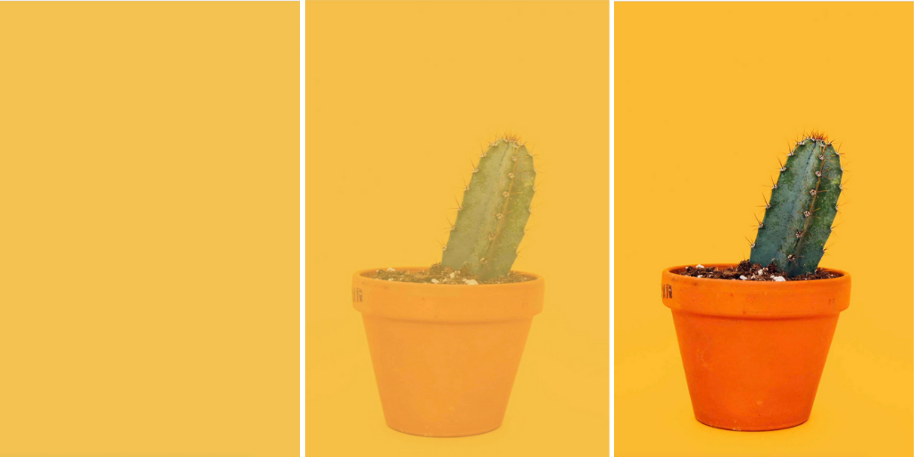

# Images in Gatsby

There are several ways you can work with images in Gatsby.  At times you may have images hardcoded into your React components or CSS.  Using images in this way works the same way it would in any React app.

Other times your images will be embedded in your markdown files or come into Gatsby via a CMS like WordPress.  This process is slightly different.

Gatsby projects also commonly integrate with a Node image optimization library called Sharp.  The Sharp library, along with a few related plugins will speed up image load times dramatically as well as provide a custom React components for loading images.

## Including Images in React Templates or Styles

The most basic way to include an image is to import the file into your React template or link to it from a CSS file.

Let's imagine for example that we had the following file structure (this is just an example and not included in our chapter code).

```
/src
	/components
	/images
		test-image.png
		background-image.png
	/pages
		404.js
		index.css
		index.js
```

Notice that we have an `images` directory with two images in it.  

If we open up the `/pages/index.js` file we can see how we can import this image and add it to our component:

```
import React from "react"

import testImage from "../images/test-image.png"

const IndexPage = () => (
  <Layout>
    <SEO title="Test" />
    <h1>Test</h1>
    
  </Layout>
)

export default IndexPage

```

Notice that when we import an image into our React file we will get a path to the image that we can pass into an `` tag.

If we open up the `index.css` we can see how to include one of these images in our CSS.

```
body {
  background: url(../images/gatsby-icon.png);
}
```

Here we do not have to import the file, we simply link to it using a relative path, just as we would in a normal CSS file.

While these methods work they miss out on many of some of the additional features and optimizations that are usually implemented in Gatsby projects.

This approach also links directly to the image files.  In Gatsby it is recommended to pull images in via GraphQL queries.  Eventually these queries will let us request specific image sizes and resolutions.

## Querying Images with GraphQL

If we launch our Gatsby project with `gatsby-develop`  and visit the Graph*i*QL interface we can make a query to `allFile` in order to find our images.


Here is the query again:

```
{
  allFile(filter: {sourceInstanceName: {eq: "images"}}) {
    edges {
      node {
        absolutePath
      }
    }
  }
}
```

Notice that we set a filter for `sourceInstanceName` equal to `images`.  This maps to the `name` option when configuring `gatsby-source-filesystem` in our `gatsby-config.js` file.

```
{
  resolve: `gatsby-source-filesystem`,
  options: {
    name: `images`,
    path: `${__dirname}/src/images`,
  },
},
```

This means that our GraphQP query will get above will get us all of our images in the `/src/images/` folder.

Once we setup the Gatsby Image component we will be able to query more information than the absolute path.  However, querying images with GraphQL in general will be something you do commonly in Gatsby projects.

Now let's take a look at the Gatsby Image component.

## The Gatsby Image Component

The Gatsby Image component is a special React component that provides some amazing features out of the box.

Here is the list of features from the documentation:

- Loads the optimal size of image for each device size and screen resolution
- Holds the image position while loading so your page doesn’t jump around as images load
- Uses the “blur-up” effect i.e. it loads a tiny version of the image to show while the full image is loading
- Alternatively provides a “traced placeholder” SVG of the image
- Lazy loads images, which reduces bandwidth and speeds the initial load time
- Uses WebP images, if browser supports the format
- Provides GraphQL fragments for faster queries

Gatsby Image does not come by default as part of Gatsby.  It relies on the Sharp image processing library and must be installed with a few plugins:

- `gatsby-image` - Includes actual React component
- `gatsby-plugin-sharp` - Provides image processing features from Sharp
- `gatsby-transformer-sharp` - Provides options for creating different sizes and resolutions of images

The default Gatsby starter that we get with `gatsby new project-name` already includes everything we need to use Gatsby Image.

However, if you were starting without it, you would run the following command:

```
npm install gatsby-transformer-sharp gatsby-plugin-sharp gatsby-image
```

This will install the necessary packages.  Then update the `gatsby-config.js` with the following addition to the plugins array:

```
  plugins: [
    `gatsby-transformer-sharp`,
    `gatsby-plugin-sharp`,
    {
      resolve: `gatsby-source-filesystem`,
      options: {
        name: `images`,
        path: `${__dirname}/src/images`,
      },
    },    
```

Again, we already have this setup with our default Gatsby started, but it is helpful to check to see if a Gatsby project has these configurations setup before attempting to use Gatsby Image.

## Querying Images for Use with Gatsby Image

Gatsby Image supports a two types of images:

1. Fixed width and height images
2. Fluid images that stretch to fill their container

It is important to know what type of image you want in your page so that you can make the appropriate query.

In order to test our queries, open up Grap*i*QL and query `allFile` again as we did earlier.


Notice now that we have an we have an option for `childImageSharp` option.

Within that we have two important fields: `fluid` and `fixed`. When we query an image for Gatsby Image we will get our images from within one of these.

### Fixed Height Queries

Let's start with looking at fixed width image queries first.  Here is a common query:


Here we get tell the query we want a `200px` square image size.  Then we get the `width`, `height`, `src`, and `srcSet`.  

Receiving `srcSet` is nice because it lets the browser load the best sized image based on the device.

Some other common fields you can get are `base64` and `tracedSVG`, which allow for image fade in effects we will discuss below.  You may also see `srcWebp` and `srcSetWebp` for getting WebP images that are highly optimized.

```
{
  allFile(filter: {sourceInstanceName: {eq: "images"}}) {
    edges {
      node {
        childImageSharp {
          fixed(height: 200, width: 200) {
            width
            height
            src
            srcSet
            base64
            tracedSVG
            srcSetWebp
            srcWebp
          }
        }
      }
    }
  }
}
```

When you know that you want a fixed image this is the type of query you will write.

### Fluid Image Queries

When you have an image that will stretch to fill its contain you want to use a `fluid` query.


Here we see the use of setting a max width, which is optional, but often a good idea.

Then we have similar fields requested, along with the `aspectRatio`, which will let the Image Component know how to stretch the image.

You can also get fields like `base64`, `tracedSVG`, `srcWebp` and `srcSetWebp` for fluid images.

### Image Query Fragments

Fragments are parts of a GraphQL query that we can reuse in multiple queries. The `gatsby-transformer-sharp` comes with several of these fragments.

Here are two that query some of the fields we have looked at above.

```
export const gatsbyImageSharpFixed = graphql`
  fragment GatsbyImageSharpFixed on ImageSharpFixed {
    base64
    width
    height
    src
    srcSet
  }
`

export const gatsbyImageSharpFluid = graphql`
  fragment GatsbyImageSharpFluid on ImageSharpFluid {
    base64
    aspectRatio
    src
    srcSet
    sizes
  }
`
```

You will commonly use a prebuilt fragment when querying images for Gatsby Image.  Here are the ones available.  It should be fairly clear what they query:

- GatsbyImageSharpFixed (common)
- GatsbyImageSharpFixed_noBase64
- GatsbyImageSharpFixed_tracedSVG (common)
- GatsbyImageSharpFixed_withWebp (common)
- GatsbyImageSharpFixed_withWebp_noBase64
- GatsbyImageSharpFixed_withWebp_tracedSVG (common)
- GatsbyImageSharpFluid (common)
- GatsbyImageSharpFluid_noBase64
- GatsbyImageSharpFluid_tracedSVG (common)
- GatsbyImageSharpFluid_withWebp (common)
- GatsbyImageSharpFluid_withWebp_noBase64
- GatsbyImageSharpFluid_withWebp_tracedSVG (common)
- GatsbyImageSharpFluidLimitPresentationSize

We have added common next to some of the common fragments you will see in Gatsby projects.

### Gatsby Image Loading Effects

Gatsby Image also provides some nice effects to elegantly load our images.

These include the following:

- Blur Up
- Background Color
- Traced SVG

### Blur Up

This is the default loading effect for images with Gatsby Image.  


With this effect, images will fade into the page to improve load time.  You do not need to do anything to get this effect.

If you do *not* want this effect you can use an image query fragment that ends in `noBase64`.


### Background Color

We can also assign a background color to load behind an image as it blurs up.



To use this effect we can simply assign a color to the `backgroundColor` prop of the Image component.


### Traced SVG

This is one of the most popular image loading effects of Gatsby Image.  It creates a tracing of your image as an SVG and automatically fades in that SVG until your image is fully loaded.


To use this effect simply choose a query fragment with `tracedSVG` at the end.


## Using Gatsby Image in a Page Component

Now that we have looked at the GraphQL queries and loading effects for working with images, let's start looking at how to use the Gatsby Image component in a hardcoded Gatsby page template.

Great a page called `/src/pages/image-test.js` with the following code to start:

```
import React from "react"
import { graphql } from "gatsby"

import Layout from "../components/layout"
import SEO from "../components/seo"

const ImageTest = () => (
  <Layout>
    <SEO title="Image Test" />
    <h1>Image Test</h1>
      <p>
        Lorem ipsum dolor sit amet, consectetur adipiscing elit. Nunc sodales
        sollicitudin placerat.
      </p>
      <p>
        Fusce feugiat gravida magna nec accumsan. Quisque at mi lacinia, vulputate urna quis, ultricies ex. Maecenas mattis sapien et enim congue, nec rutrum risus commodo. 
      </p>
      <p>
        Donec ante diam, ullamcorper non accumsan et, bibendum vel sapien. Phasellus pharetra mi venenatis orci lobortis tincidunt ut ut lorem. Phasellus iaculis, odio quis blandit maximus, velit lacus semper quam,
        non vestibulum tortor purus at lacus.
      </p>
      <p>
        Donec placerat neque at ipsum cursus, vitae vehicula est lacinia.Aliquam blandit ipsum eu tincidunt volutpat. Ut iaculis mattis turpis. Maecenas luctus ex nec risus molestie dapibus. Vestibulum nisl neque, pretium vitae efficitur at, accumsan non dolor. Ut posuere est nisl, id suscipit erat finibus sit amet.
      </p>
  </Layout>
)

export default ImageTest
```

You can copy in your own lorem ipsum dummy text or get it from the completed example code for the chapter.

Now, make sure you have a `gatsby-icon.png` and `alan-carrillo-HIghIy9i0aY-unsplash.jpg` image to your `/src/images/` folder.  You can find these files in the completed code as well.  (Credit to Alan Carrillo for the canyons photo).

Now we are going to write two image queries at the bottom of the page.  One for a fixed version of the Gatsby icon and one for a fluid version of the canyon photo from Alan.

Add the following query to the bottom of the `image-test.js` page.

```
export const imageTestQuery = graphql`
  query {
    canyons: file(
      relativePath: { eq: "alan-carrillo-HIghIy9i0aY-unsplash.jpg" }
    ) {
      childImageSharp {
        fluid(maxWidth: 1200) {
          ...GatsbyImageSharpFluid
        }
      }
    }
    gatsbyIcon: file(relativePath: { eq: "gatsby-icon.png" }) {
      childImageSharp {
        fixed(width: 200, height: 200) {
          ...GatsbyImageSharpFixed
        }
      }
    }
  }
`
```

Notice that we are simply including our two image queries side by side.  One of the great things about GraphQL is that you can make multiple independent queries in one request.

This will get passed into our `ImageTest` component as a `data` object on props.  So we need to update our component with the following so we have easy access to the data from this query:

```
const ImageTest = ({ data }) => (
  // Stays the same for now.
)
```

Next we will import the Gatsby `Img` component at the top of our file:

```
import React from "react"
import { graphql } from "gatsby"
import Img from "gatsby-image"
``` 

Now we can add our images to our page.  We will add our fluid canyons image at the top of the page above the `h1`.

```
<SEO title="Image Test" />
<div>
  
</div>
<h1>Image Test</h1>
```

We have wrapped our image inside of a `<div>`.  This is not completely necessary, but helpful if we wanted to add some custom CSS to control the width of an image.  Because image tags are inline elements by default, you generally want to wrap your `` component in some block level element like a `<p>`.

Then in the `` component we pass in the fluid version of the image we requested on the fluid prop.  Remember, to get a fluid image that scales to the full width of it's container, you must query the fluid version of the image *and* pass that data into the `fluid` props.

Next we will add our fixed Gatsby logo within our paragraphs.

```
<p>
  Fusce feugiat gravida magna nec accumsan. Quisque at mi lacinia, vulputate
  urna quis, ultricies ex. Maecenas mattis sapien et enim congue, nec rutrum
  risus commodo.
</p>

<p>
  Donec ante diam, ullamcorper non accumsan et, bibendum vel sapien.
  Phasellus pharetra mi venenatis orci lobortis tincidunt ut ut lorem.
  Phasellus iaculis, odio quis blandit maximus, velit lacus semper quam, non
  vestibulum tortor purus at lacus.
</p>
```

Notice that we are applying some CSS to our `` component to float it right and give it some margins.  You could also apply a `className` prop if you wanted to add a class to the image wrapper on the page.

Go ahead and run `gatsby develop` to test.  You should see something like the image below.

 

Before you move on, try customizing your image queries like the following:

```
canyons: file(
  relativePath: { eq: "alan-carrillo-HIghIy9i0aY-unsplash.jpg" }
) {
  childImageSharp {
    fluid(
      maxWidth: 500
      traceSVG: { background: "#fed49e", color: "#f48e67" }
    ) {
      ...GatsbyImageSharpFluid_withWebp_tracedSVG
    }
  }
}
gatsbyIcon: file(relativePath: { eq: "gatsby-icon.png" }) {
  childImageSharp {
    fixed(
      width: 200
      height: 200
      traceSVG: { background: "white", color: "#a67ecf" }
    ) {
      ...GatsbyImageSharpFixed_withWebp_tracedSVG
    }
  }
}
```

This will let you see the traced SVG in action and show you how to set custom colors for the background and trace color so they look best for your images.


*NOTE: Most browser developer tools let you mimic different connection speeds under the Network tab so you can see the full effect of the image loading.*


Now that we looked at how to query and load images with Gatsby Image on page components, let's look at non page components because the query is slightly different.

## Using Gatsby Image in a Non-Page Component

Page components are those in the `/src/pages/` directory that automatically create pages in Gatsby.  Non page components are usually stored in the `/src/components/` folder and included in other components.  They do not automatically create pages.

Queries in non-page components work a little differently and require something called a "static query."  Our actually GraphQL query will look the same, but the way we set it up and the way it works behind the scenes is a little different.

What we will do is look at how to add the Gatsby logo to our `<Header />` component.

Open the `/src/components/header.js` file and import `useStaticQuery` and `graphql` from `gatsby`, as well as `Img` from `gatsby-image`.

```
import React from "react"
import PropTypes from "prop-types"
import { Link, useStaticQuery, graphql } from "gatsby"
import Img from "gatsby-image"
```

Now you want to modify your Header function to include curly braces instead of just returning an element:

```
const Header = ({ siteTitle }) => {
  return (
    <header
      style={{
        background: `rebeccapurple`,
        marginBottom: `1.45rem`,
      }}
    >
    // Everything else stays the same
    </header>
  ) 
}
```

Now we can add our static query for the image inside of the component.  This is one of the way static queries are different than dynamic page queries.  They go inside of our component function, rather than outside.

We will add in a new image called `Gatsby_Monogram_White.png` from the Gatsby logo and brand guide.  You can find the image in the completed files for this chapter in the `src/images/` directory.

This is what our static query will look like:

```
const Header = ({ siteTitle }) => {
  const data = useStaticQuery(graphql`
    query {
      logo: file(relativePath: { 
        eq: "Gatsby_Monogram_White.png" 
      }) {
        childImageSharp {
          fixed(width: 44, height: 44) {
            ...GatsbyImageSharpFixed
          }
        }
      }
    }
  `)

  return (
    // Everything else stays the same
  )
```

Notice that we are assigning the static query to the `data` object.  Then we search for the `Gatsby_Monogram_White.png` file and set it to a fixed height and width of `44px`.

This image will now be available to us as the following:

```
data.logo.childImageSharp.fixed
```

Next we will add the image using the `` component.  Come down and add the image right before the `<h1>`.

```

```

This will add the fixed image as well as float it to the left and provide it with some right margin. 

Your result should look like this:


We could easily add more image queries to our static query in the way we did in our page component.

You will use static queries in this way anytime you need an image in a non-page component.

This gives us some solid examples and starting points for when we need to include images in our Gatsby templates and components.

Now let's look at how we can use images in our markdown content.


## Adding Featured Images to Markdown Frontmatter

What we will do in this step is add a featured image to each markdown blog post as part of the frontmatter.

First, we will setup the images themselves.  Create an `images` directory inside of the `content` directory.  You can find a collection of five images to use in the final code for this chapter:

```
jerry-wang-5V47P1bPXRI-unsplash.jpg
niko-photos-tGTVxeOr_Rs-unsplash.jpg
peter-conlan-axYF1KFjoDY-unsplash.jpg
riccardo-chiarini-2VDa8bnLM8c-unsplash.jpg
woo-hyeon-kim-1FQkplvYPSo-unsplash.jpg
```

Then open up each markdown blog post and add a link to one of the images link this:

```
---
slug: "hello-world"
date: "2020-05-11"
title: "Hello World"
excerpt: "A hello world post."
featuredImage: "../images/jerry-wang-5V47P1bPXRI-unsplash.jpg"
---
```

Now we need to configure our `gatsby-source-filesystem` configurations to know to look inside our `/content/images/` directory for files.

Open up the `gatsby-config.js` file and add the following:

```
{
  resolve: `gatsby-source-filesystem`,
  options: {
    name: `contentImages`,
    path: `${__dirname}/content/images`,
  },
},
```

Now we will query the featured image inside our `/src/templates/post.js` file.

```
export const postQuery = graphql`
  query($slug: String!) {
    markdownRemark(frontmatter: { slug: { eq: $slug } }) {
      html
      frontmatter {
        date(formatString: "MMMM DD, YYYY")
        title
        featuredImage {
          childImageSharp {
            fluid(maxWidth: 800) {
              ...GatsbyImageSharpFluid
            }
          }
        }
      }
    }
  }
`
```

Notice that we have access to `childImageSharp` and all of its features for the `featuredImage`.

Now, above the main content in our `PostTemplate` component we can add our image.

```
<Layout>
  <SEO title={frontmatter.title} />
  <p style={{ fontSize: `70%` }}>
    Published {frontmatter.date}
  </p>
  
  <div dangerouslySetInnerHTML={{ __html: html }} />
</Layout>
```

This should result in having your featured image display above a post.


Now let's turn our attention to how to include images in our markdown content directly.

## Using Inline Images in Markdown

When it comes to adding images within our markdown files we have to take an additional configuration step.

First, install the `gatsby-remark-images` plugin.  This will allow Gatsby to display markdown images using Gatsby Image automatically.

Make sure the development server is off and run the following command:

```
npm install gatsby-remark-images 
```

Then come into the `gatsby-config.js` file and change the following:

```
`gatsby-transformer-remark`
```

To this:

```
{
  resolve: `gatsby-transformer-remark`,
  options: {
    plugins: [
      {
        resolve: `gatsby-remark-images`,
        options: {
          maxWidth: 960,
        },
      },
    ],
  },
},
```

Now Gatsby will automatically convert our markdown images into Gatsby images!

Add the following image to your `/content/images/` folder (you can find it in the completed files for the chapter:

```
aaron-burden-GVnUVP8cs1o-unsplash.jpg
```

Then add several paragraphs of lorem ipsum dummy text to the `20200511-hello-world.md`.  You can copy this dummy text from an online lorem ipsum generator or from the completed files.

Then display the image between one of the paragraphs of text using the default markdown image syntax.

```
Ultricies mi quis hendrerit dolor magna eget. Nisi vitae suscipit tellus mauris a diam maecenas. Habitasse platea dictumst vestibulum rhoncus est. Volutpat sed cras ornare arcu dui vivamus arcu felis bibendum. Ultrices dui sapien eget mi. Cursus turpis massa tincidunt dui ut ornare lectus sit. Sed libero enim sed faucibus turpis in eu mi bibendum.


Proin sagittis nisl rhoncus mattis rhoncus urna. Nunc non blandit massa enim nec dui nunc mattis. Diam maecenas ultricies mi eget. Nisl suscipit adipiscing bibendum est ultricies integer quis auctor. Aliquet nec ullamcorper sit amet risus nullam eget felis. 
```  

You can now restart your development server and you should see the image display on the page stretching to the full width.


While this is great you will notice that the image displays the full width.  In order to display images of different widths or float them in the page we will need to take a different approach.

To style our images in our markdown posts we will have to use MDX.

## Styling Images in Markdown with MDX

MDX is markdown that allows the use of JSX and React components.  This can allow for powerfully styling and laying out pages in Markdown.

To get this setup, stop the server and install the following:

```
npm install gatsby-plugin-mdx @mdx-js/mdx @mdx-js/react
```

Then update your `gatsby-config.js` file to include the following:

```
{
  resolve: `gatsby-plugin-mdx`,
  options: {
    extensions: [`.mdx`, `.md`],
  },
},
```

This will let us use JSX and React components in our markdown files.  Usually MDX files require the extension `.mdx`.  This configuration will let us use the normal `.md` extension that we have been using so far.

Next we will need a new image to add to our markdown post.  Use the `pixpoetry-oI7OWlsOCGU-unsplash.jpg` from the completed files and add it to the `/content/images/` directory.

Then in your `20200511-hello-world.md` post add the following code between two of the paragraphs of text.

```
<div 
  className="right-align" 
  style="float: left; width: 200px; margin-right: 15px;"
>
  
</div>
```

This will provide you with an image that floats to the left of the page.


We can use this approach for styling images in markdown, but at a certain point you might want to look into importing React components.  We will look at adding importing React components into our MDX markdown in the next chapter.

## Next Steps

At this point we have learned a lot about Gatsby.  In fact, we know almost everything we need to launching production ready sites with Gatsby.

In the next chapter we will look at how to add more dynamic features to our sites like contact forms, comments newsletter sign up forms.

From there we will go over how to deploy Gatsby sites and we're ready to go!