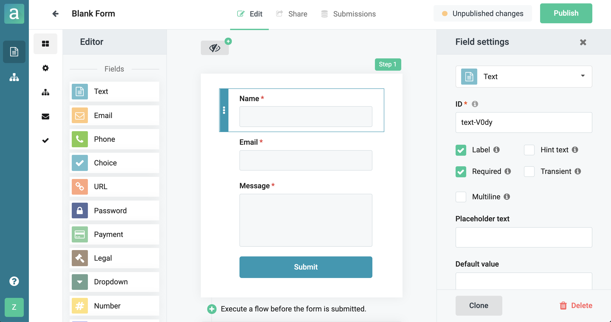
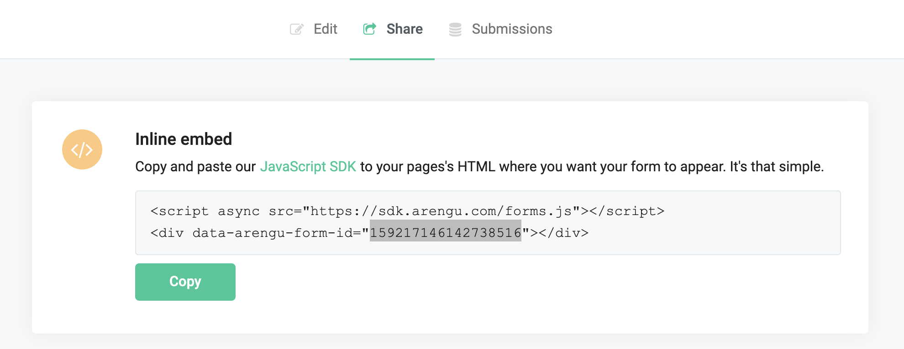
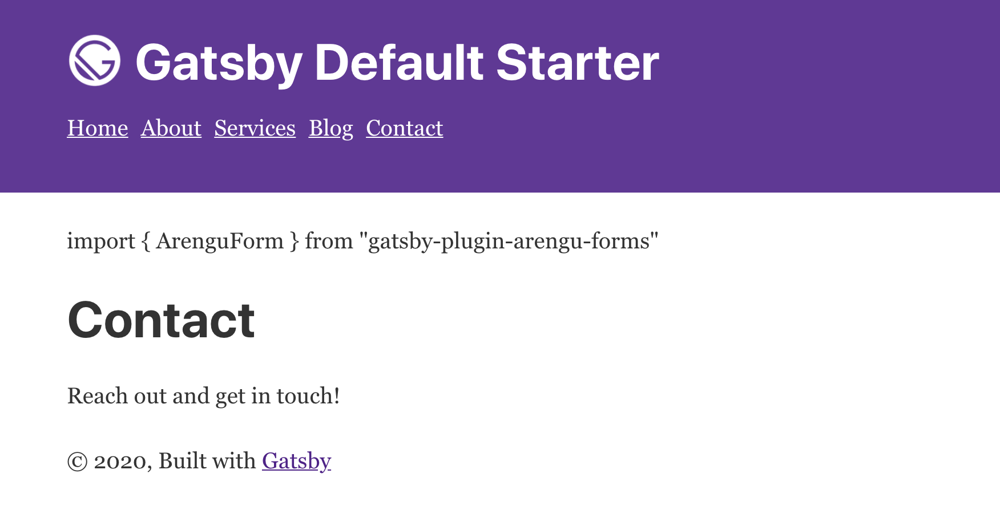
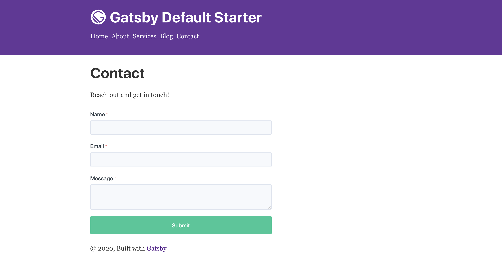
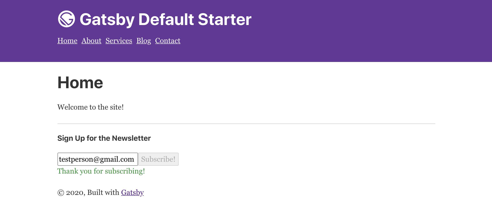
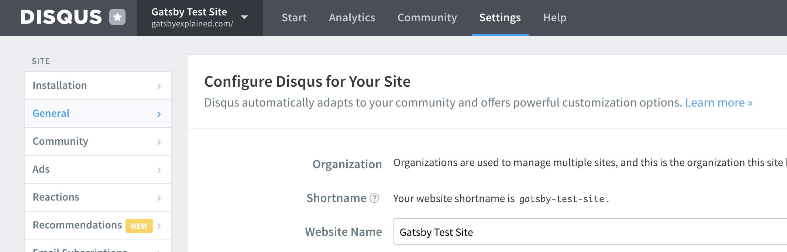
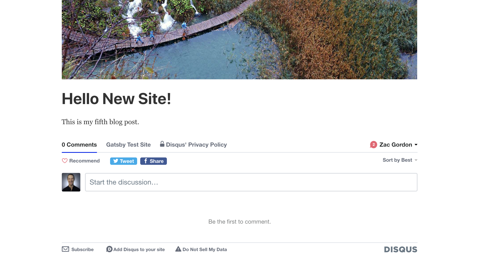
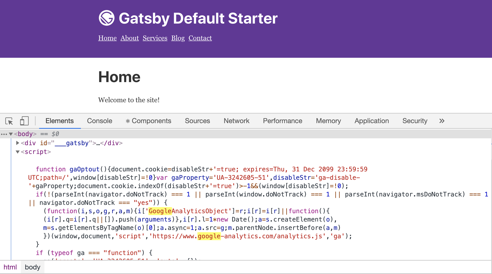

# Extending Gatsby with Plugins and Packages

We have actually already looked at a number of Gatsby Plugins in this book.  However, most of these plugins helped with core functionality with our site, like the ability to read files or process images.

In this chapter we will look at various plugins and packages that help us add more dynamic functionality to our Gatsby sites.  

This will include the following functionality:

- Contact Forms
- Newsletter Signup Form
- Comments
- Tracking Analytics

For each feature we cover, several options exist.  Once you learn how to use the specific plugins we use in this chapter it will be easy for you to switch to alternative solutions.

## Adding Contact Forms to a Gatsby Site

The easiest way to add contact forms to a Gatsby site is to use a third party form tool, like Arengu (https://www.arengu.com/).  This will give you a UI for building forms and a dashboard for seeing all form submissions.  It also leverages the Arengu servers for delivering the emails.  Since Arengu offers free plans and a Arengu Gatsby Plugin already exists, this is a great solution.

The other approach to contact forms on a Gatsby site is to build your form in React and leverage a tool like Formspree (https://formspree.io) to send the forms to you.  An option like this does not generally provide you a dashboard to view your submission or a UI for building your forms, but it will handle the sending of emails for you.

Both of these approaches can also allow you to integrate with Zapier if you want additional integrations.

Let's look at how to get setup with using Arengu forms in a Gatsby site.  First, go to https://www.arengu.com/ and sign up for a free account.  Then walk though their guide on building a contact form.  You should find it intuitive software to use.



Next we can install the Arengu Gatsby Plugin.  To start, copy the completed `chapter-05` folder to a `chapter-06` folder.

Then run the following command:

```
npm install --save gatsby-plugin-arengu-forms
```

The plugin does not require any special configuration, but we do have to add `gatsby-plugin-arengu-forms` to the list of plugins in the `gatsby-config.js` file. Make sure to add it there before proceeding.

Now, we can open our `/content/pages/contact.md` file and add our contact form.

Update your contact form page with the following:

```
---
slug: "contact"
title: "Contact"
---

import { ArenguForm } from "gatsby-plugin-arengu-forms"

# Contact

Reach out and get in touch!

<ArenguForm id="1234567890" />
```

You will have to lookup the ID for your Arengu form.  You can find that in the form builder under the "Share" tab.  Look in the first embed code to find the ID.



Once you have the form setup, launch `gatsby-develop` and take a look at the contact page.  Even if you setup everything correctly, you will notice it does not work.



The reason for this is that when we setup our MDX in the last chapter we did not configure our page and post templates to work with importing components.

Let's do that now.  Open up your `/src/templates/page.js` file and make the following changes:

```
import React from "react"
import { graphql } from "gatsby"
import { MDXRenderer } from "gatsby-plugin-mdx"

import Layout from "../components/layout"
import SEO from "../components/seo"

const PageTemplate = ({ data }) => {
  const { frontmatter, body } = data.mdx
  return (
    <Layout>
      <SEO title={frontmatter.title} />
      <MDXRenderer>{body}</MDXRenderer>
    </Layout>
  )
}

export default PageTemplate

export const pageQuery = graphql`
  query($slug: String!) {
    mdx(frontmatter: { slug: { eq: $slug } }) {
      body
      frontmatter {
        title
      }
    }
  }
`
```

We have made a few important changes here:

1. Import the `MDXRenderer` component
2. Change the `pageQuery` to use `mdx` instead of `markdownRemark`
3. Get the `body` field of the `html` field
4. Display the page content using the `<MDXRenderer>` component instead of `dangerouslySetInnerHTML`

Now when we view our page we can see the contact form correctly display.



If you would like to import components into your posts as well, you should make the same changes to the `/src/templates/post.js` file as well.

Go ahead and test your contact form and you should see the results show up in the Arengu dashboard for your form under the "Submissions" tab.

Now let's take a look at adding a different type of form to our site.

## Adding a Newsletter Signup Form

Most websites now include a newsletter signup form somewhere on the site.  In this example we will look at how to create a signup form in the footer and then connect it to Mailchimp.  

Other popular newsletter services exist and you can follow a similar approach for working with them.

To create a Mailchimp newsletter signup form we will not actually have to use a Gatsby plugin.  Since this functionality can be accomplished entirely with React, we can simply use an existing Mailchimp signup form React component.

To start, install the following package:

```
npm install react-mailchimp-form
```

Now open the `/src/components/layout.js`  file and import the Mailchimp component from the package we just installed:

```
import Mailchimp from "react-mailchimp-form"
```

Then we can setup the component inside of our `<footer>` like so:

```
<footer>
  <hr />
  <h4>Sign Up for the Newsletter</h4>
  <Mailchimp
    action="https://XXXXXXXX.us4.list-manage.com/subscribe/post?u=YYYYYYYYYYYY&id=ZZZZZZZZZZZ"
    fields={[
      {
        name: "EMAIL",
        placeholder: "Email",
        type: "email",
        required: true,
      },
    ]}
  />
  © {new Date().getFullYear()}, Built with
  {` `}
  <a href="https://www.gatsbyjs.org">Gatsby</a>
</footer>
```

The most important part of this is the action URL.  This is unique for your Mailchimp account.  To get this URL do the following:

1. Login to your Mailchimp account
2. Click on "Audience"
3. Then click on the "Signup Forms" tab
4. Select "Embedded Forms"
5. Look in the Copy/paste embed code for `<form action="YOURURL"`

Use this URL in place of the dummy URL used above.

Now when you start `gatsby-develop` you should see the newsletter signup form in the footer.



If you test the form it should work properly as well!  

As mentioned, there are many different services that offer newsletter signup functionality.  Depending on what service you use the approach you need to take may differ slightly than with this example.

## Adding Comments to a Gatsby Site

There are two main approaches to adding comments to posts or pages with Gatsby.  The simplest approach is to use a third party service that includes a Gatsby plugin or easily embedded code.  

The more complex approach involves building the forms and handling the submissions and republishing of the Gatsby site when comments are approved.  This approach is beyond the scope of this book, so we will go with the simpler approach.

In this example we will use a comment service called "Disquss" because it is the simplest.  However, it is also one of the more bloated options and has been known to sell your data.  Although it is commonly used, it is worth exploring other options down the road.

To begin, sign up for a free account at https://disqus.com.  Then, under your site's General Settings, look for your site `Shortname`.  It will look something like `your-site-name`.



Now stop your development server and install the Disquss Gatsby Plugin with the following command:

```
npm install --save gatsby-plugin-disqus
```

Next we will configure out `gatsby-config.js` file to include the following:

```
{
  resolve: `gatsby-plugin-disqus`,
  options: {
    shortname: `your-disqus-shortname`
  }
},
```

Make sure to add the correct Shortname for your site.

Now we can update our `post.js` template to include the Disquss comment component.

Open your `/src/templates/post.js` file and import the Disquss component at the top of the page.

```
import { Disqus } from 'gatsby-plugin-disqus'
```

Then add the following configuration variable inside of the `PostTemplate` function.

```
const PostTemplate = ({ data }) => {
  const { frontmatter, body } = data.mdx
  const disqusConfig = {
    shortname: `your-site-shortname`,
    config: { 
       identifier: frontmatter.slug, 
       title: frontmatter.title 
     },
  }
  // Rest stays the same for now
```

This will require that you add the `slug` field to the `postQuery` at the bottom of the file.  Make sure to do that before proceeding.

Finally you can include the `<Disqus />` component like so:

```
<Layout>
  <SEO title={frontmatter.title} />
  <p style={{ fontSize: `70%` }}>Published {frontmatter.date}</p>
  
  <MDXRenderer>{body}</MDXRenderer>
  <Disqus {...disqusConfig} />
</Layout>
```

The configuration props are optional but recommended.  

When you run your development server and look at a post now you will see the Disquss comments enabled.



As mentioned, there are various comment options and each one has a slightly different configuration process.  You might look into  Commento, Staticman and Gittalk as other possible options.

## Adding Tracking Analytics to a Gatsby Site

Most sites today include tracking of some kind.  While Google Analytics is the most common, many site builders are switching away to less privacy invading options like Simple Analytics (https://simpleanalytics.com) or Matomo (https://matomo.org).

Most tracking analytics just involves adding some simple JavaScript to the page, but we can still use one of the many Gatsby Plugins to make our setup process even easier.

For this project we are going to install Google Analytics tracking simply because the other options are paid.  However, we do recommend exploring options besides Google Analytics for your Gatsby sites.

To start you will need to get your Google Tracking ID, which you can find under your Account Settings > Property Settings.  It generally looks something like `UA-54516992-1`.

Next, install the Google Analytics Gatsby Plugin with the following command (remember, you development server must be off to do this):

```
npm install --save gatsby-plugin-google-analytics
```

Next, open your `gatsby-config.js` file and add the following settings:

```
{
  resolve: `gatsby-plugin-google-analytics`,
  options: {
    trackingId: "UA-54516992-1",
    anonymize: true,
    respectDNT: true,
    head: false,
  },
},
```

This will configure the Google Analytics plugin so that it anonymizes IP addresses and respects "Do Not Track" requests. Additionally, it will make sure to load the analytics code at the bottom of the page rather than in the header.

Make sure to add in the tracking ID for your site.

The Google Analytics plugin is disabled when running `gatsby develop`.  So in order to test you will need to stop your server and run the following command:

```
gatsby build
``` 

Once that is complete, start the Gatsby server to run the production version of your site.

```
gatsby serve 
```

This should start your production site on `localhost:9000`.  When you open up the web inspector and search for "google" you will find your analytics code embedded below the main content of the site.



Now you have analytics up and running on your site.  As mentioned, we do suggest exploring some of the Google Analytics alternatives like Simple Analytics and Matomo.

## Next Steps

At this point in our learning process we have learned the basics of setting up and building sites with Gatsby as well as how to extend it with plugins and packages.

We are now ready to look at how to launch our Gatsby sites.  In the next chapter we will explore how to deploy production ready Gatsby sites.

