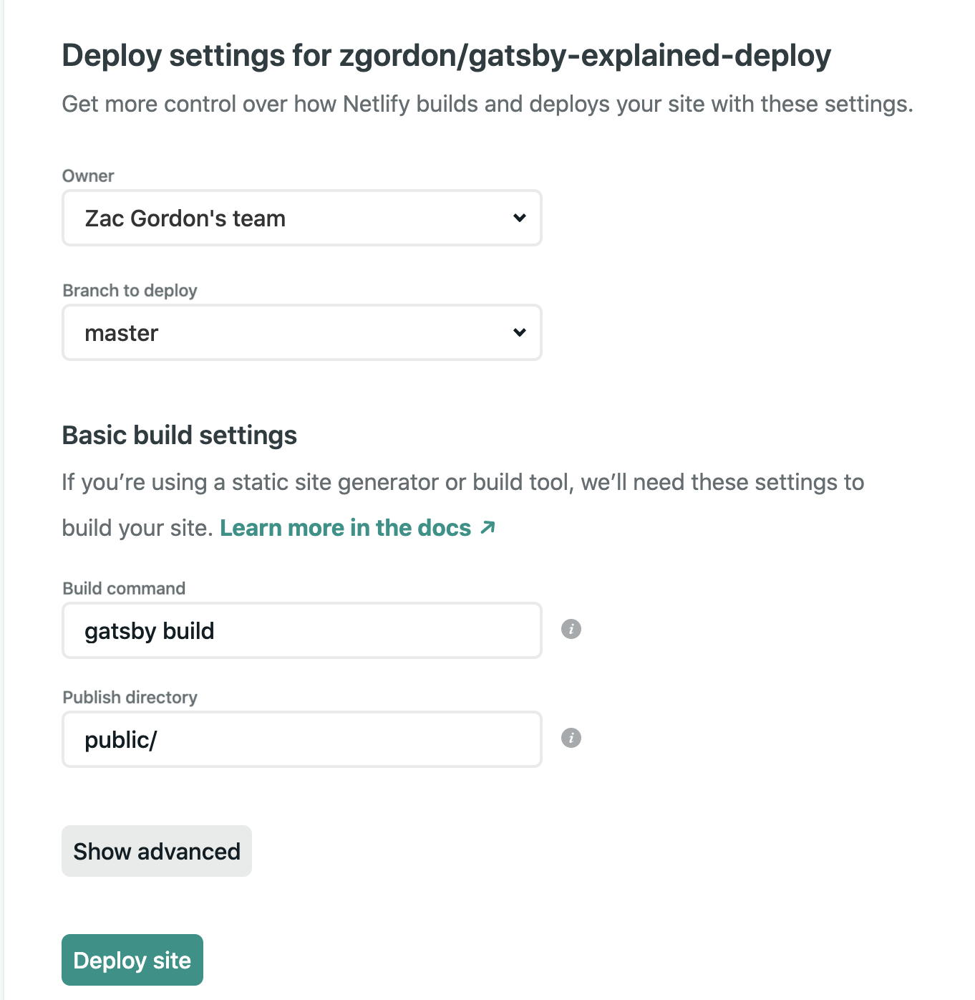
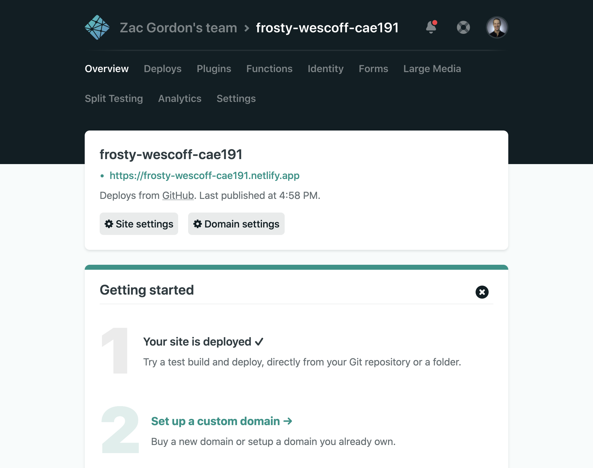
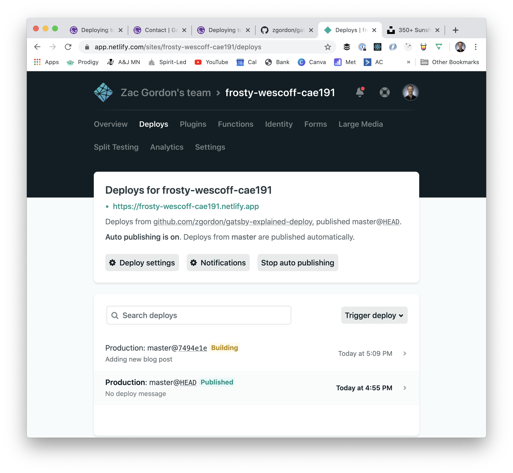

# Deploying Gatsby Sites

The final production code for a Gatsby site includes an HTML file for each page as well as the all the necessary CSS and JavaScript.  The optimized images and other necessary assets are also included.

In order to prepare your Gatsby site for deployment you must run the Gatsby build command.  

For this chapter we will duplicate the code from the last chapter.  Create a new `chapter-07` directory and copy the contents of the `chapter-06` directory into it.

Once you have your project for this chapter setup run the following command:

```
gatsby build
```

This will create a `public` directory with the final production ready code for your project.

## Uploading Gatsby Sites Manually

The files in this `public` directory can be uploaded onto any hosting environment that supports HTML, CSS and JavaScript, which most do.

However, the process of manually uploading your site can be laborious if you are regularly making updates to your sites and needing to manually re-upload all of your files.

For this reason, more integrated solutions exist and are more common for hosting Gatsby sites.

## Hosting Integrations that Build for You

One of the most common features for hosting providers that specialize in Gatsby hosting is the ability to check automatically if changes have been made to your code base and run the Gatsby build process automatically for you.

The prevents you from having to manually re-upload your site to your hosting provider every time you make a change.
\
The hosting solution we use in this chapter, follows this process:

1. Check a GitHub project to see if changes have been made (via a commit to a branch of your choosing)
2. Run the `gatsby build` command for you on their servers
3. Automatically serve the `public` folder once the build process is complete

For this to work you must first setup a repo on Github to host your project.  A full explanation of how to do this is a bit beyond our scope here so we will assume that you are able to setup a Github repo.

## Setting Up Your Github Repo

Once you have a GitHub repo setup for your Gatsby project, go ahead and clone it locally to your computer.  Make sure not to do this inside of the directory holding the practice exercises for this book.

Then copy the contents of your `chapter-07` Gatsby project into this local Github repo directory.  Do not copy over the `node_modules` directory or the `package-lock.json` file.

Then run `gatsby build` once and push the changes to your Github repo.

You should now have a Github repo with the core Gatsby files, your site source code, your markdown content and the `public` folder with your final production code. 

Now we are ready to connect this Github account to a Gatsby hosting provider.

## Setting Up Netlify Hosting

We will use Netlify hosting (https://www.netlify.com) for this book, although several other hosting solutions exist like Amazon AWS Amplify, Amazon S3, Heroku, Surge, Azure and others.

Go ahead and setup a free Netlify account.

Then click "New site from Git" and click the button to connect to Github.  Then you can search for the repo you just created and pushed your Gatsby site to.



On the next page you will receive a few options.  One of the important ones is the branch.  With some projects you will be able to push your live site to `master` and leave this setting as is.  However, with some projects you may want to setup a branch called `deploy` and only push your production code to that branch.

Then we see a setting for the Build command.  Netlify will automatically recognize that this is a Gatsby project and populate the field with `gatsby build`, which is what we want.  It will now run this command anytime it sees a new commit to the branch you selected above.

Finally it will verify that you want your site to be pulled from the `public` directory.  Leave all of these settings as is unless you start making customizations, which go beyond what we have discussed in this book.

Then click Deploy.




On the next screen you will see a notification showing you the build process is happening.  Once that is done you will see a confirmation that your site has been deployed.

There are additional steps that you can take to configure a custom domain name that we will leave you to explore on your own.

## Testing the Automatic Build Process

Now that we have our initial site deployed, let's look at the process for updating our site.

Come back into your repo for deployment and add a new blog post with the file name `20200516-hello-deployed.md` and the following content:

```
---
slug: "hello-deployed"
date: "2020-05-16"
title: "Hello Deployed Site"
excerpt: "The new site is live!"
featuredImage: "../images/aaron-burden-BTubi6qaY6Q-unsplash.jpg"
---

# Hello Deployed Site!

This is my first post from my live site!
```

You can find the image used in the completed code for this chapter.

Once you have this new post and image added, commit your changes and push them to Github.
\
Now come back into your Netlify dashboard and click on the "Deploys" tab for your project.  You should see a notice that the build process is occurring based on your latest commit.



Once that process is complete you can visit your live site and see the new blog post.

This is the process you will follow going forward to in order to update your Gatsby site.  Simply make the changes and push them to Github.

## Wrapping Up

At this point we have covered the basics of deploying a Gatsby site for production.  I suggest you make sure to follow along so you get comfortable with this process.

If you want to dig deeper into deployments with Gatsby you might try looking into setting up a Netlify staging URL based on a different branch of your Github repo.

However, you should have the essential steps needed to launch production ready Gatsby sites.


